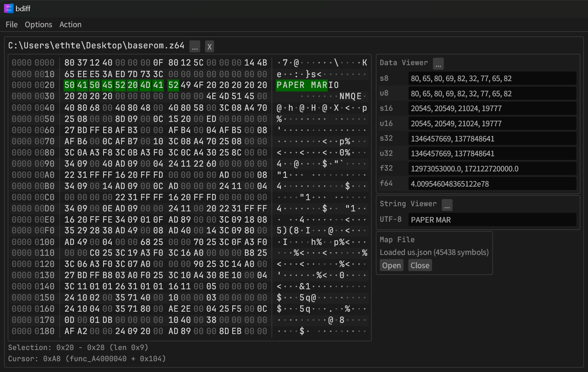

# bdiff

A(nother) binary diff tool, targeted toward decompilation and modding projects.




## Features
- Automatic reload of opened files on change
- Pairwise byte diff display (vbindiff style)
- String, data viewer for various formats and encodings
- Support for displaying symbol information from binaries by parsing json output from [mapfile_parser](https://github.com/Decompollaborate/mapfile_parser)

bdiff is currently in the very early stages of development. See the [issues](https://github.com/ethteck/bdiff/issues) for planned features.

## Why?

There's a million other hex viewers out there. Most people in the game decompilation scene use vbindiff, a very dependable but somewhat feature-sparse tool. Over the years, I've started wishing for little things here and there that I wish it could do, and I've also been looking to learn Rust.

## Configuration

To provide a more convenient experience, projects can specify a "bdiff.json" configuration file which defines a startup configuration for the program. An example config follows:

```
{
    "files": [
        {
            "path": "C:\\somethin.z64",
            "map": "C:\\somethin.map"
        },
        {
            "path": "C:\\another.z64",
            "map": "C:\\another.map"
        }
    ]
}
```

So far, the configuration format simply consists of a list of files to open (`files`).

For each file, there are two fields:

* `path`: The path to the file
* `map` (optional): The path to a .map file, to be parsed so symbol information is displayed in the viewer