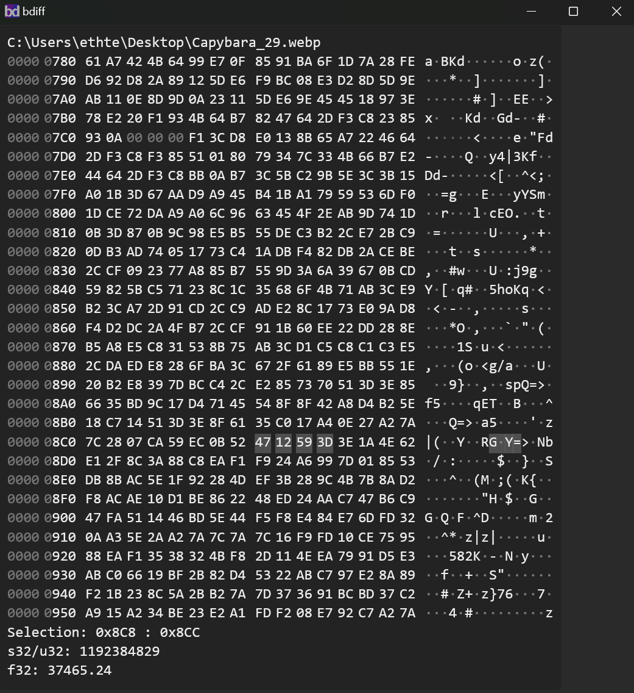

# bdiff

A(nother) binary diff tool, targeted toward decompilation and modding projects.

bdiff is currently in the very early stages of development. See the [issues](https://github.com/ethteck/bdiff/issues) for planned features.

## Why?

There's a million other hex viewers out there. Most people in the game decompilation scene use vbindiff, a very dependable but somewhat feature-sparse tool. Over the years, I've started wishing for little things here and there that I wish it could do, and I've also been looking to learn Rust.

## What?

A few things that I feel are sorely lacking from vbindiff which I'd like to accomplish here are as follows:
- Reloading the target file when it changes and displaying updated contents
- Being able to quickly convert highlighted spans to base-10 ints, floats, or other custom datatypes
- Knowing where in a target binary I am looking at in terms of object file, symbol, vram, etc
- Display cutomizations (colors, sizes, options in general)

## Cool!
Aw, thanks! really kind of you to go out of your way to say that on my readme.

Please feel free to contribute too, if you're interested. Help a Rust noob out!